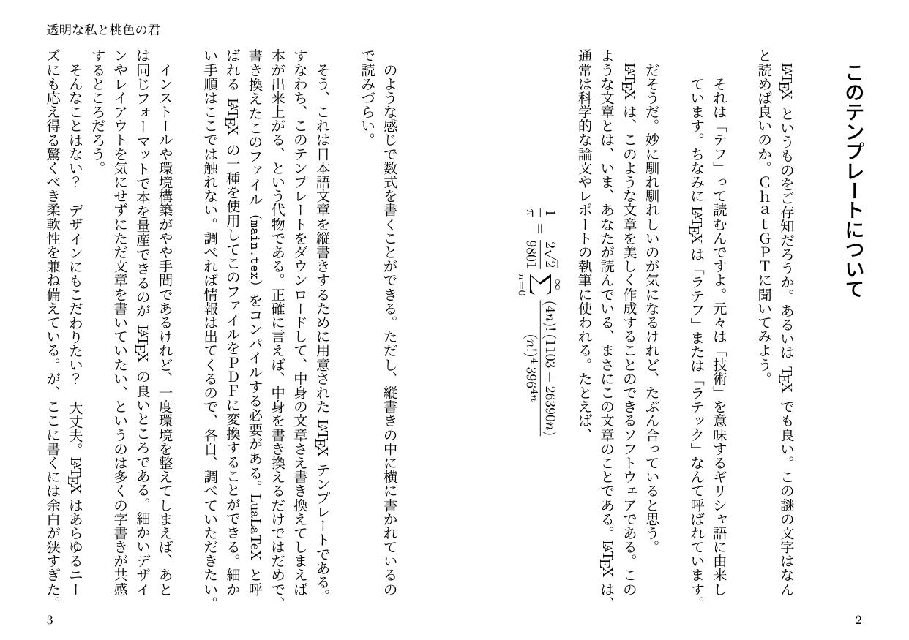

[](https://deepwiki.com/radish2951/sizukana-essay)

# sizukana-essay



**sizukana-essay** は、縦書きの日本語エッセィや小説を、文庫本のような体裁で手軽に作成するための LaTeX テンプレートです。
`lualatex` と `jlreq` クラスをベースにしており、美しい日本語組版を実現します。

## 特徴

### 縦書き日本語組版
A6サイズ、文庫本サイズの縦書きレイアウト。

### シンプル構成
`main.tex` に本文を書き進めるだけで、美しい本に仕上がるようデザインされています。

### カスタマイズ可能
`essaystyle.sty` で目次や章タイトル、ページスタイルなどを調整済み。フォントの指定も可能です。
### モダンな環境
`lualatex` を使用し、ルビ (`luatexja-ruby`) や縦中横も利用できます。

## ファイル構成
```
sizukana-essay/
├── README.md         (このファイル)
├── LICENSE           (ライセンスファイル)
└── src/
    ├── essaystyle.sty  (デザイン設定用のスタイルファイル)
    ├── main.tex        (本文を記述するメインファイル)
    └── okuzuke.tex     (奥付情報ファイル)
```

## 使い方

### 1. 準備
このテンプレートを使用するには、`LuaLaTeX` が利用可能な LaTeX 環境が必要です。
TeX Live, MacTeX, MikTeX などの一般的な TeX ディストリビューションに含まれています。
LaTeX 環境のインストールや設定方法については、ウェブ上の豊富な情報を参照し、各自でご準備ください。

#### フォントについて
このテンプレートでは `fontspec` パッケージを使用しており、デフォルトではシステムにインストールされている日本語フォントが利用されます。
特定のフォントを使用したい場合は、`src/essaystyle.sty` ファイルの先頭あたり（`\ProvidesPackage` の後など）に、以下のように追記してください。

```latex
\setmainjfont{IPAexMincho} % 例: IPAex明朝を指定
% または
% \setmainjfont{Source Han Serif JP} % 例: 源ノ明朝を指定
```
上記はあくまで例ですので、お使いの環境にインストールされているフォント名を指定してください。

### 2. 執筆
-   `src/main.tex` を開いて、書籍のタイトル、著者名、本文などを編集します。
-   `src/okuzuke.tex` を開いて、奥付情報を編集します。
-   内容はもちろん、既存のレイアウトやコマンドも自由に編集いただけます。

### 3. ビルド（PDF生成）
以下のいずれかの方法で PDF を生成できます。

-   **VSCode + LaTeX Workshop 拡張機能 (推奨):**
    1.  VSCode で `src/main.tex` を開きます。
    2.  LaTeX Workshop 拡張機能のビルドコマンド (`Ctrl+Alt+B` または `Cmd+Alt+B`) を実行します。
        レシピは `lualatex` を使用するように設定してください。
-   **コマンドライン:**
    1.  ターミナル (コマンドプロンプト) を開き、`src` ディレクトリに移動します。
    2.  以下のコマンドを **2〜3回** 実行します (目次や相互参照を正しく反映するため)。
        ```bash
        lualatex main.tex
        ```

ビルドが成功すると、`src` ディレクトリ内に `main.pdf` が生成されます。

## サンプルPDF
ビルドが成功すると、以下のようなPDFが作成されます。


## カスタマイズ
より詳細なデザインの調整（フォントサイズ、余白、行間、見出しのスタイルなど）は、`src/essaystyle.sty` ファイルを編集することで可能です。
`jlreq` クラスや各LaTeXパッケージのドキュメントも参考に、自由にカスタマイズしてみてください。

## ライセンス
このテンプレートは MIT License の下で公開されています。
詳細は `LICENSE` ファイルをご覧ください。

## 作者
池田大輝（Daiki Ikeda）[@radish2951](https://twitter.com/radish2951)

ご不明な点や感想など、お気軽にご連絡ください！
